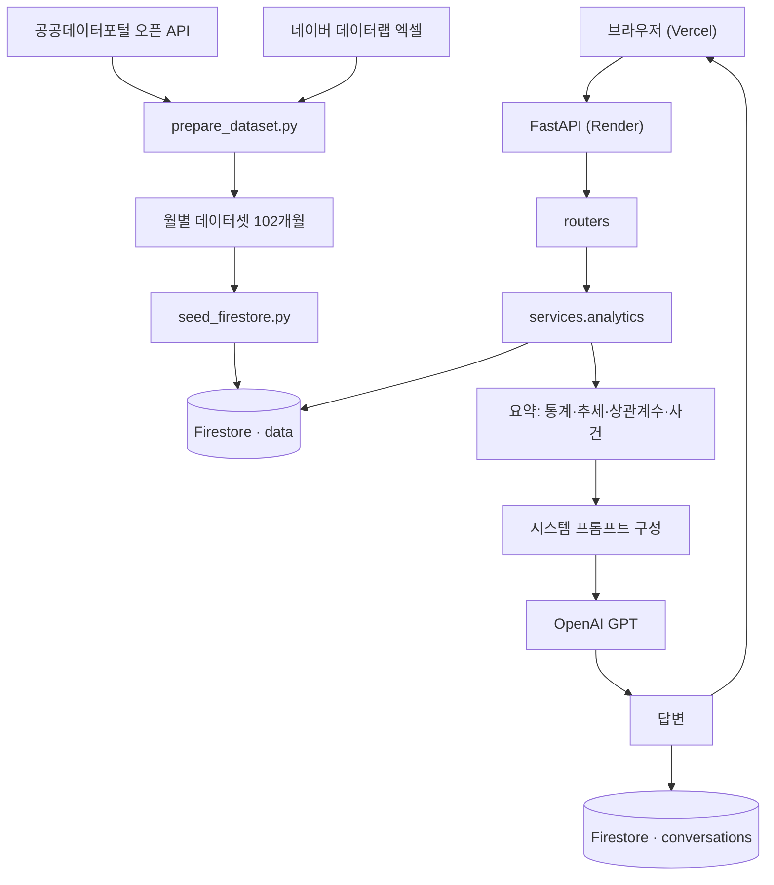
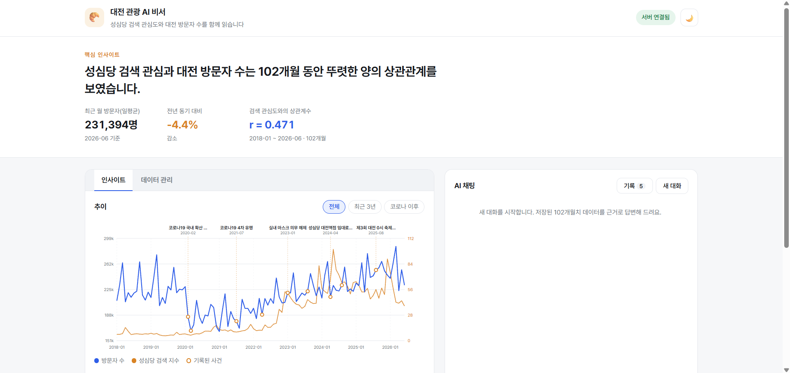
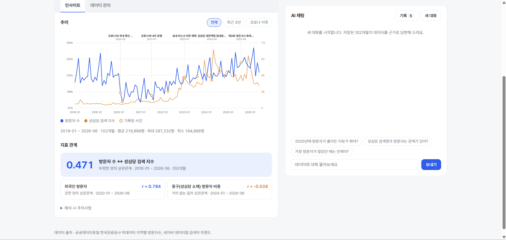
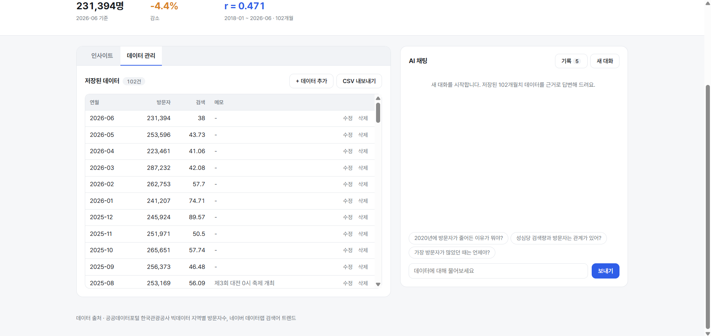
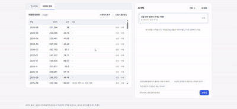
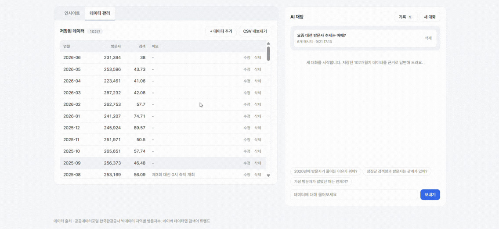

# 대전 관광 AI 비서

> **Codyssey M1-2 · AI Agent 개발: 나만의 AI 비서 구축**
> 공개 데이터로 만든 102개월치 대전 관광 데이터셋을 Firestore에 저장하고, 그 요약을 GPT의 시스템 프롬프트에 주입해 **내 데이터만 근거로 답하는** 웹 서비스입니다.

<p align="center">
  
  
  
  
  
  
  
</p>

---

## Summary

| 구분 | 내용 |
|---|---|
| 해결한 문제 | 일반 챗봇은 내 데이터를 모른 채 일반론으로만 답하는 문제 |
| 구현 형태 | FastAPI 백엔드 + 바닐라 JS 프론트엔드 웹 서비스 |
| 데이터 주제 | 대전 방문자 수(이동통신 빅데이터)와 "성심당" 검색 관심도 |
| 데이터 규모 | 월별 **102개월** (2018-01 ~ 2026-06), 일별 원본 23,195건에서 집계 |
| 핵심 흐름 | 공공데이터 수집 → 월별 정제 → Firestore 적재 → 요약 계산 → 프롬프트 주입 → GPT 답변 → 대화 자동 저장 |
| 요약 지표 | 기간·개수·통계·전년 동기 대비 추세·상관계수 3종·사건 목록·해석 주의사항 |
| 핵심 발견 | 성심당 검색 관심과 대전 방문자는 **r = 0.471**, 외국인 방문자는 **r = 0.784** |
| 배포 | 백엔드 Render, 프론트엔드 Vercel (GitHub 푸시 시 자동 재배포) |
| 보너스 | 추가 지표 3종 · SVG 그래프 · CSV 내보내기 · 다크 모드 (4/4) |
| 안정성 | 지연 초기화, 단계별 예외 처리, 콜드스타트 대응, CORS 화이트리스트 |

### 배포 URL

| 대상 | 주소 |
|---|---|
| 프론트엔드 | <https://codyssey-m1-2-theta.vercel.app> |
| 백엔드 API | <https://codyssey-m1-2-vix0.onrender.com> |
| Swagger UI | <https://codyssey-m1-2-vix0.onrender.com/docs> |

> 백엔드는 Render 무료 인스턴스라 15분간 요청이 없으면 절전 상태가 됩니다.
> 첫 요청은 30초~1분 걸릴 수 있어, 프론트엔드가 진입 시 `/health`를 먼저 호출해 서버를 깨우고 안내 문구를 표시합니다.

### 바로가기

- [프로젝트 개요](#overview)
- [문제와 해결 방법](#problem--solution)
- [데이터로 확인한 것](#data-story)
- [처리 흐름](#architecture)
- [핵심 기능](#features)
- [실행 화면](#screenshots)
- [폴더 구조](#project-structure)
- [API 명세](#api)
- [실행 방법](#how-to-run)
- [배포](#deployment)
- [환경 변수](#environment-variables)
- [데이터 파이프라인](#data-pipeline)
- [오류 처리](#error-handling)
- [테스트](#testing)
- [공식 미션 요구사항](#공식-미션-요구사항-체크리스트)
- [오류 해결과 변경 이력](#troubleshooting--changes)
- [주요 의사결정](#key-decisions)

---

# Overview

"성심당이 유명해지면 대전 관광객도 늘까?"

이 질문을 일반 챗봇에게 물으면 일반론이 돌아옵니다. 실제로 답하려면 데이터가 있어야 합니다.
공공데이터포털의 이동통신 기반 방문자 수와 네이버 데이터랩의 검색 지수를 직접 수집해 102개월치 데이터셋을 만들고,
Firestore에 저장한 뒤 그 요약을 GPT에게 컨텍스트로 넘겨 **저장된 숫자만 근거로 답하는** 비서를 구현했습니다.

## What We Built

1. **Data Pipeline**
   - 공공데이터포털 오픈 API로 대전 일별 방문자 수집 (광역 8,735건 · 기초 14,460건)
   - 네이버 데이터랩 검색 지수와 병합해 월별 102개월 데이터셋 생성
   - 문서 ID를 연월로 지정해 재실행해도 중복이 생기지 않는 Firestore 적재

2. **Analytics as a Service**
   - 평균·최대·최소·최근 값, 전년 동기 대비 추세
   - 피어슨 상관계수 3종과 **각각의 계산 구간·표본 수**
   - memo 기반 사건 목록과 해석 주의사항

3. **Context-Injected Chatbot**
   - 요약을 시스템 프롬프트에 삽입한 뒤 GPT 호출
   - 직전 대화 10개까지 함께 전달해 맥락 유지
   - 질문과 답변을 `conversations` 컬렉션에 자동 저장

4. **Vanilla Web Client**
   - 결론을 먼저 보여주는 인사이트 밴드
   - 인라인 SVG 이중 축 그래프 + 사건 주석 + 기간 필터
   - 데이터 CRUD, 대화 기록 불러오기, CSV 내보내기, 다크 모드

5. **Production Deployment**
   - Render Secret File로 서비스 계정 키 관리
   - Vercel 빌드 단계에서 API 주소 주입
   - CORS 화이트리스트와 콜드스타트 대응

## Tech / Tools

| 영역 | 사용 기술 | 역할 |
|---|---|---|
| Language | Python 3.11.15 | 백엔드 및 데이터 파이프라인 |
| Framework | FastAPI 0.141.1 · Uvicorn 0.53.0 | REST API, 자동 문서화(Swagger) |
| Validation | Pydantic v2 | 요청 검증, 응답 스키마 |
| Database | Firebase Firestore (firebase-admin 7.5.0) | 데이터·대화 저장 |
| LLM | OpenAI `gpt-4.1-mini` (openai 3.14.0) | 데이터 기반 답변 생성 |
| Frontend | HTML5 · CSS3 · Vanilla JavaScript | 프레임워크 없이 구현 |
| Visualization | 인라인 SVG | 차트 라이브러리 없이 이중 축 그래프 |
| Collection | urllib · openpyxl · xlrd | 오픈 API 호출, 엑셀 파싱 |
| Deploy | Render · Vercel · GitHub | 자동 배포 |

---

# Problem & Solution

## Problem

데이터 기반 AI 서비스를 만들 때 실제로 부딪힌 문제들입니다.

- 공식 관광지 입장객 통계는 집계 대상이 시기마다 바뀌어 **시계열로 쓰면 없는 급감이 만들어집니다.**
- 지표마다 제공 기간이 달라(2018 / 2020 / 2024 시작) 하나의 상관계수로 말하면 오해를 부릅니다.
- 방문자 수는 계절성이 강해 직전 3개월과 비교하면 계절 변동을 추세로 착각합니다.
- 요약에 숫자만 넣으면 AI가 "왜 줄었는지"를 답하지 못하고, 기간을 임의로 추측합니다.
- 서비스 계정 키는 줄바꿈이 포함된 JSON이라 환경 변수 한 줄로 넣기 번거롭습니다.
- 네이버 데이터랩 오픈 API는 2026-07-31부로 신규 신청이 중단되었습니다.

## Solution

| 문제 | 해결 방법 |
|---|---|
| 집계 대상 변동으로 인한 가짜 급감 | 주 지표를 이동통신 기반 방문자 수로 교체하고, 입장객 통계는 비교 검증용으로만 사용 |
| 지표별 제공 기간 차이 | 상관계수마다 **계산 구간과 표본 수**를 함께 응답, 값 없는 달은 0이 아니라 필드 생략 |
| 계절성으로 인한 추세 왜곡 | 추세를 **전년 동기 대비**로 계산하고 비교한 두 구간을 응답에 포함 |
| AI가 원인을 설명하지 못함 | memo를 사건 목록(`events`)으로 만들어 프롬프트에 함께 주입 |
| AI의 과장·단정 | "중복 집계", "관심 지표", "상관≠인과"를 주의사항으로 주입 |
| 서비스 계정 키 관리 | Render **Secret File**로 업로드하고 경로만 환경 변수로 전달 |
| 데이터랩 API 신규 신청 중단 | 과거 데이터는 1회 수집이면 충분하므로 웹 엑셀 다운로드로 전환 |

---

# Data Story

처음 가설은 "성심당 인기 ↑ → 대전 관광객 ↑"였습니다. 계산해 보니 **어떤 데이터를 쓰느냐에 따라 결론이 달라졌습니다.**

| 주 지표 | 성심당 검색 지수와의 상관계수 | 해석 |
|---|---:|---|
| 관광지점 입장객 통계 (공식 집계) | **-0.05** | 관계 없음 |
| 대전 외지인 방문자 (이동통신) | **+0.47** | 뚜렷한 양의 상관 |
| 대전 외국인 방문자 (이동통신) | **+0.78** | 강한 양의 상관 |

입장객 통계는 과학관·박물관 등 특정 시설만 집계해 원도심 방문 흐름을 담지 못했습니다.
게다가 2023년 12월에 집계 대상 관광지 8곳이 빠져 **2024년에 방문객이 반토막 난 것처럼 보이는 함정**이 있었습니다.

| 연도 | 30개 관광지 입장객 | 성심당 검색 지수 |
|---|---:|---:|
| 2022 | 10,225,887 | 250 |
| 2023 | 10,659,448 | 545 |
| **2024** | **5,747,011** | 782 |

공간적으로도 확인했습니다. 성심당 본점이 있는 **중구만 다른 구보다 빠르게 성장**했습니다.

| 구 | 2024년 일평균 | 2025년 일평균 | 증가율 |
|---|---:|---:|---:|
| **중구** (성심당 본점) | 122,889 | 134,999 | **+9.9%** |
| 동구 | 113,921 | 120,718 | +6.0% |
| 서구 | 170,819 | 181,230 | +6.1% |
| 유성구 | 166,439 | 175,079 | +5.2% |
| 대덕구 | 73,884 | 78,218 | +5.9% |

다만 **월 단위 등락은 함께 움직이지 않습니다.** 검색량은 뉴스 이슈로 튀고, 방문자는 느리게 변합니다.
그래서 서비스는 "상관은 있지만 인과는 아니다"라고 답하도록 설계했습니다.

---

# Architecture



## 컨텍스트 주입 흐름

`POST /api/chat`의 동작 순서입니다.

1. `analytics.build_summary()`로 요약 계산 — HTTP로 자기 API를 다시 부르지 않고 서비스 함수를 직접 호출
2. 요약을 시스템 프롬프트에 삽입
3. 직전 대화 최대 10개와 함께 GPT 호출 (`max_completion_tokens` 500 제한)
4. 질문과 답변을 `conversations`에 자동 저장

실제 주입되는 프롬프트의 일부입니다.

```text
[사용자 데이터 요약]
- 분석 기간: 2018-01 ~ 2026-06
- 데이터 개수: 102개월
- 방문자 지표: 평균 219,898명 / 최대 287,232명 / 최소 164,668명 / 최근 231,394명
- 최근 추세: 최근 3개월(2026-04~2026-06) 평균이 전년 동기(2025-04~2025-06) 대비 -4.4% (감소)
- 지표 간 상관관계:
  - 성심당 검색 지수: r=0.471 (뚜렷한 양의 상관관계, 2018-01 ~ 2026-06, 102개월)
  - 외국인 방문자: r=0.784 (강한 양의 상관관계, 2020-01 ~ 2026-06, 78개월)

[데이터에 기록된 주요 사건]
  - 2020-02: 코로나19 대구 집단감염, 위기경보 심각 격상 (해당 월 방문자 185,964명)
  - 2024-05: 임대료 논란 확산, 성심당 검색 지수 최고치 (해당 월 방문자 230,999명)

[해석 시 주의사항]
  - 방문자 수는 이동통신 기반 추정치로, 같은 사람이 여러 날 방문하면 중복 집계된다.
  - 상관관계는 인과관계를 뜻하지 않는다.
```

---

# Features

## 1. 핵심 인사이트 밴드

첫 화면 상단에 결론 한 문장과 핵심 수치 3개(최근 방문자 · 전년 동기 대비 · 대표 상관계수)를 배치했습니다.
카드를 나열하는 대신 "그래서 무엇인가"를 먼저 보여주기 위한 구성입니다.

## 2. 추이 그래프 (인라인 SVG)

| 요소 | 구현 |
|---|---|
| 이중 축 | 왼쪽 방문자 수(천 명), 오른쪽 검색 지수(0~100) |
| 사건 주석 | memo가 있는 달에 점과 라벨 표시, 라벨 간격이 좁으면 자동 생략 |
| 기간 필터 | 전체 / 최근 3년 / 코로나 이후 |
| 툴팁 | 마우스 위치에서 가장 가까운 달의 수치와 사건 표시 |

차트 라이브러리를 쓰지 않고 `path`, `line`, `text`를 직접 계산해 그렸습니다.

## 3. 데이터 관리 (CRUD)

- 추가: 연월 형식(`YYYY-MM`), 0 이상 방문자 수, 0~100 검색 지수를 Pydantic이 검증
- 수정: 행을 인라인 편집 폼으로 전환해 값·메모 수정
- 삭제: 확인 후 삭제, 삭제 즉시 그래프와 요약 재계산
- 내보내기: BOM을 포함한 CSV로 저장해 엑셀에서 한글이 깨지지 않게 처리

## 4. AI 채팅

추천 질문 칩, 타이핑 로딩 표시, 대화 이어가기를 제공합니다.
`conversation_id`를 유지해 후속 질문에서 맥락이 이어집니다.

## 5. 대화 기록

채팅 패널의 `기록` 버튼으로 목록을 열고, 클릭하면 메시지를 복원합니다.
목록 API는 본문을 제외해 가볍게 응답하고, 본문은 단건 조회에서 받습니다.

## 6. 다크 모드

CSS 변수로 토큰을 정의하고 `data-theme` 속성으로 전환합니다.
첫 방문 시 브라우저 설정을 따르고, 이후 선택은 `localStorage`에 저장합니다.

---

# Screenshots

## 메인 화면 — 결론과 핵심 수치를 먼저

<p align="center">
  
</p>

## 추이 그래프와 지표 관계

사건 주석이 그래프 위에 표시되고, 상관계수는 대표 지표를 크게 보여줍니다.

<p align="center">
  
</p>

## 데이터 관리

<p align="center">
  
</p>

## 시연 ① AI 채팅과 대화 기록 불러오기

추천 질문으로 대화를 시작하고, 답변이 저장된 데이터를 인용하는 과정입니다.
`기록` 버튼으로 이전 대화를 불러오면 메시지가 복원되고 이어서 질문할 수 있습니다.

<p align="center">
  
</p>

## 시연 ② 데이터 추가 · 수정 · 삭제

데이터를 추가하면 목록과 그래프, 요약 지표가 함께 갱신됩니다.
수정은 행을 인라인 편집으로 전환해 처리하고, 삭제는 확인 후 반영합니다.

<p align="center">
  
</p>

> 시연 화면은 GIF로 제공합니다. 원본 영상(mp4)은 용량이 커서 저장소에 포함하지 않았습니다.

---

# Project Structure

```text
M1-2/
├── assets/
│   ├── images/                     # 제출 스크린샷
│   └── videos/                     # 시연 영상
├── backend/
│   ├── main.py                     # 앱 생성 · CORS · 라우터 등록
│   ├── core/
│   │   ├── config.py               # 환경 변수 로드 (Settings)
│   │   └── firebase.py             # Firestore 클라이언트 (지연 초기화)
│   ├── routers/                    # HTTP 경계: 상태 코드와 예외 변환
│   │   ├── health.py               # GET /health
│   │   ├── data.py                 # /api/data CRUD + summary
│   │   ├── conversations.py        # /api/conversations
│   │   └── chat.py                 # POST /api/chat
│   ├── services/                   # 도메인 로직: 라우터 없이도 재사용 가능
│   │   ├── data_service.py         # Firestore CRUD
│   │   ├── analytics.py            # 통계 · 추세 · 상관계수 · 사건
│   │   ├── conversation_service.py
│   │   └── chat_service.py         # 프롬프트 구성 + GPT 호출
│   ├── schemas/                    # Pydantic 요청·응답 모델
│   ├── scripts/                    # 수집 · 정제 · 적재 (서비스 구동에는 불필요)
│   ├── data/
│   │   ├── raw/                    # 원본 CSV · 엑셀
│   │   └── processed/dataset.json  # 월별 102개월 데이터셋
│   ├── .env                        # 로컬 전용, 커밋 금지
│   ├── .env.example
│   ├── requirements.txt            # 서버 구동용
│   └── requirements-dev.txt        # 엑셀 파싱 등 스크립트 전용
├── frontend/
│   ├── index.html                  # 탭 기반 단일 화면
│   ├── style.css                   # 테마 토큰 · 반응형
│   ├── app.js                      # 상태 · 렌더 · SVG 차트 · API 호출
│   ├── config.js                   # 빌드 시 API_BASE_URL 주입
│   └── vercel.json                 # buildCommand · outputDirectory
├── .gitignore
└── README.md
```

> `.env`, `.venv/`, `__pycache__/`, 서비스 계정 JSON은 `.gitignore`로 제외했고,
> 커밋 전 `git check-ignore`로 실제 제외 여부를 확인했습니다.

---

# API

| 메서드 | 경로 | 설명 |
|---|---|---|
| GET | `/health` | 서버 상태 확인 (콜드스타트 대비) |
| GET | `/api/data` | 데이터 목록 (연월 오름차순, `limit` 지원) |
| POST | `/api/data` | 데이터 추가 (문서 ID = 연월, 중복 시 409) |
| PUT | `/api/data/{id}` | 부분 수정 (전달한 필드만 반영) |
| DELETE | `/api/data/{id}` | 데이터 삭제 |
| GET | `/api/data/summary` | 요약 — 통계 · 추세 · 상관계수 · 사건 · 주의사항 |
| POST | `/api/chat` | AI 대화 (요약 주입 + 자동 저장) |
| GET | `/api/conversations` | 대화 목록 (본문 제외) |
| POST | `/api/conversations` | 대화 저장 |
| GET | `/api/conversations/{id}` | 특정 대화 전체 메시지 조회 |
| DELETE | `/api/conversations/{id}` | 대화 삭제 |

> `/api/data/summary`는 `/api/data/{id}`보다 **먼저 선언**해야 `summary`가 ID로 해석되지 않습니다.

## 요약 응답 예시

```json
{
  "subject": "대전 방문자 수와 성심당 검색 관심도",
  "period": "2018-01 ~ 2026-06",
  "count": 102,
  "metrics": { "average": 219898, "max": 287232, "min": 164668, "latest": 231394 },
  "trend": {
    "direction": "감소",
    "change_rate": -4.4,
    "description": "최근 3개월(2026-04~2026-06) 평균이 전년 동기(2025-04~2025-06) 대비 -4.4% (감소)"
  },
  "correlations": [
    { "metric": "성심당 검색 지수", "r": 0.471, "period": "2018-01 ~ 2026-06", "count": 102 },
    { "metric": "외국인 방문자", "r": 0.784, "period": "2020-01 ~ 2026-06", "count": 78 },
    { "metric": "중구(성심당 소재) 방문자 비중", "r": -0.028, "period": "2024-01 ~ 2026-06", "count": 30 }
  ],
  "events": [{ "date": "2020-02", "memo": "코로나19 대구 집단감염, 위기경보 심각 격상", "value": 185964 }],
  "notes": ["방문자 수는 이동통신 기반 추정치로, 같은 사람이 여러 날 방문하면 중복 집계된다."]
}
```

---

# How to Run

## 1. 저장소 복제 및 이동

```powershell
git clone https://github.com/qjskffj-code/codyssey_M1-2.git
cd codyssey_M1-2\backend
```

## 2. 가상환경 생성 및 활성화

```powershell
python -m venv .venv
```

```powershell
.\.venv\Scripts\Activate.ps1
```

PowerShell 실행 정책으로 활성화가 제한되면 현재 터미널에만 다음 설정을 적용합니다.

```powershell
Set-ExecutionPolicy -Scope Process -ExecutionPolicy RemoteSigned
```

## 3. 패키지 설치

```powershell
python -m pip install -r requirements.txt
```

## 4. 환경 변수 설정

```powershell
Copy-Item .env.example .env
```

```dotenv
OPENAI_API_KEY=YOUR_OPENAI_API_KEY
FIREBASE_SERVICE_ACCOUNT_PATH=C:/keys/firebase-service-account.json
ALLOWED_ORIGINS=http://localhost:5500,http://127.0.0.1:5500
```

- 서비스 계정 JSON은 **파일 전체 경로**를 지정합니다. 폴더 경로만 넣으면 실행 시 `PermissionError`가 발생합니다.
- 실제 키는 README, 캡처, 채팅 또는 Git 커밋에 포함하지 않습니다.

## 5. Firestore 연결 확인 (선택)

```powershell
python -m pip install -r requirements-dev.txt
python -m scripts.check_firebase
```

## 6. 백엔드 실행

```powershell
uvicorn main:app --reload
```

<http://localhost:8000/docs> 에서 Swagger UI로 API를 확인할 수 있습니다.

## 7. 프론트엔드 실행 (다른 터미널)

```powershell
cd ..\frontend
python -m http.server 5500
```

<http://localhost:5500> 에서 접속합니다. `localhost`로 열면 `config.js`가 자동으로 로컬 백엔드를 바라봅니다.

---

# Deployment

## 백엔드 (Render)

| 항목 | 값 |
|---|---|
| Root Directory | `backend` |
| Build Command | `pip install -r requirements.txt` |
| Start Command | `uvicorn main:app --host 0.0.0.0 --port $PORT` |
| Instance Type | Free |
| Secret File | `firebase-service-account.json` → `/etc/secrets/firebase-service-account.json` |

서비스 계정 키는 환경 변수에 한 줄로 밀어 넣지 않고 **Secret File**로 업로드한 뒤 경로만 환경 변수로 전달합니다.

## 프론트엔드 (Vercel)

`frontend/vercel.json`이 빌드 설정을 갖고 있습니다.

```json
{
  "buildCommand": "echo \"window.API_BASE_URL='$API_BASE_URL';\" > config.js",
  "outputDirectory": ".",
  "cleanUrls": true
}
```

| 항목 | 값 |
|---|---|
| Framework Preset | Other |
| Root Directory | `frontend` |
| Environment Variable | `API_BASE_URL` = 백엔드 주소 (끝에 `/` 없이) |

> 배포 후 **반드시** Render의 `ALLOWED_ORIGINS`에 Vercel 도메인을 추가합니다.
> 빠뜨리면 화면은 뜨지만 데이터가 하나도 보이지 않습니다.

---

# Environment Variables

| 이름 | 필수 | 설명 |
|---|:---:|---|
| `OPENAI_API_KEY` | 필수 | OpenAI API 키 |
| `OPENAI_MODEL` | 선택 | 기본 `gpt-4.1-mini` |
| `OPENAI_MAX_TOKENS` | 선택 | 응답 토큰 상한, 기본 500 |
| `FIREBASE_SERVICE_ACCOUNT_PATH` | 둘 중 하나 | 서비스 계정 JSON 경로 (로컬 · Render Secret File) |
| `FIREBASE_SERVICE_ACCOUNT_JSON` | 둘 중 하나 | 서비스 계정 JSON 문자열 |
| `ALLOWED_ORIGINS` | 필수 | CORS 허용 도메인, 쉼표 구분 |
| `API_BASE_URL` | 필수(Vercel) | 프론트엔드가 바라볼 백엔드 주소 |
| `DATA_GO_KR_API_KEY` | 선택 | 공공데이터포털 인증키 (수집 스크립트 전용) |

권장 `.gitignore`:

```gitignore
.env
*firebase-adminsdk*.json
*serviceAccount*.json
.venv/
__pycache__/
.vercel/
```

> 키가 유출된 것 같으면
> ① 발급처에서 즉시 폐기·재발급 → ② Render·Vercel 환경 변수 교체 후 재배포
> → ③ 커밋 이력에 남았다면 히스토리에서 제거 후 강제 푸시

---

# Data Pipeline

`backend` 폴더에서 실행합니다. 실행 전 `pip install -r requirements-dev.txt`가 필요합니다.

```powershell
python -m scripts.check_firebase          # Firestore 연결 확인
python -m scripts.fetch_region_visitors   # 대전 광역 일별 방문자 수집
python -m scripts.fetch_district_visitors # 대전 5개 구 일별 방문자 수집
python -m scripts.prepare_dataset         # 원본 → 월별 데이터셋 정제
python -m scripts.seed_firestore          # Firestore 적재
```

| 단계 | 스크립트 | 내용 |
|---|---|---|
| 수집 | `fetch_region_visitors.py` | 광역 일별 방문자 2018-01 ~ 2026-08, 대전 8,735건 |
| 수집 | `fetch_district_visitors.py` | 대전 5개 구 일별 방문자 2024-01 ~, 14,460건 |
| 수집 | (수동) | 네이버 데이터랩에서 "성심당" 일별 검색 지수 엑셀 다운로드 |
| 정제 | `prepare_dataset.py` | 일별 → 월별 집계, 세 소스 병합, 사건 메모 부착 |
| 적재 | `seed_firestore.py` | 배치 쓰기, 문서 ID = 연월이라 재실행해도 중복 없음 |

오픈 API에 지역 필터 파라미터가 없어 전국 264개 시군구를 받아 대전만 걸러냅니다.
개발계정 일일 호출 한도(1,000회)를 넘지 않도록 기간을 나눠 호출합니다.

## 데이터 항목

| 필드 | 내용 | 기간 |
|---|---|---|
| `date` | 연월 (`YYYY-MM`, 문서 ID로도 사용) | 2018-01 ~ 2026-06 |
| `value` | 대전 외지인 방문자 일평균 | 102개월 전체 |
| `ref_value` | "성심당" 검색 지수 (최댓값 100 기준) | 102개월 전체 |
| `foreign_value` | 대전 외국인 방문자 일평균 | 2020-01 ~ |
| `junggu_share` | 대전 5개 구 중 중구 방문자 비중(%) | 2024-01 ~ |
| `memo` | 코로나 조치 · 축제 · 성심당 이슈 등 사건 | 해당 월만 |

값이 없는 달은 **0이 아니라 필드를 비워 둡니다.** 0으로 채우면 "2019년 외국인 0명"이라는 잘못된 답이 나옵니다.

## 사건 메모의 근거

AI가 급등·급락을 설명할 때 그대로 인용하는 정보라, 1차 출처로 확인한 내용만 넣었습니다.

| 연월 | 메모 | 확인한 출처 |
|---|---|---|
| 2020-02 | 코로나19 대구 집단감염, 위기경보 심각 격상 | 보건복지부 중앙재난안전대책본부 브리핑 |
| 2020-03 | 강화된 사회적 거리두기 시행(3.22) | [정책브리핑](https://www.korea.kr/special/policyFocusView.do?newsId=148876230) |
| 2021-07 | 코로나19 4차 유행, 수도권 거리두기 4단계(7.12) | [보건복지부 보도자료](https://mohw.go.kr/board.es?act=view&bid=0027&list_no=366376) |
| 2022-04 | 사회적 거리두기 전면 해제(4.18) | [정책브리핑](https://www.korea.kr/news/policyNewsView.do?newsId=148900782) |
| 2023-01 | 실내 마스크 의무 해제(1.30) | [정책브리핑](https://www.korea.kr/news/policyNewsView.do?newsId=148911139) |
| 2023-08 | 제1회 대전 0시 축제(8.11~17) | 대전광역시 축제 공식 자료 |
| 2024-04 | 성심당 대전역점 임대료 논란 시작 | 코레일유통 입찰 공고(월 4억 4,100만 원) 보도 |
| 2024-05 | 논란 확산, 성심당 검색 지수 최고치 | 수집 데이터에서 2024-05가 100(최댓값) |
| 2024-08 | 제2회 대전 0시 축제(8.9~17) | [대전광역시](https://www.daejeon.go.kr/) 보도자료 |
| 2024-09 | 임대료 월 1.3억으로 타결 | 2024-09-27 보도 (4.4억 → 1.33억 조정) |
| 2025-08 | 제3회 대전 0시 축제(8.8~16) | [2025 대전0시축제 공식 홈페이지](https://djzerofe.com/) |

---

# Error Handling

| 상황 | HTTP | 처리 방식 |
|---|:---:|---|
| 같은 달 데이터 중복 추가 | 409 | "2026-06 데이터가 이미 있습니다." |
| 잘못된 연월(`2099-13`) · 음수 방문자 | 422 | Pydantic 검증 메시지 반환 |
| 없는 데이터 수정 · 삭제 | 404 | "해당 데이터를 찾을 수 없습니다." |
| 수정할 필드가 비었을 때 | 400 | "수정할 필드가 없습니다." |
| 없는 대화 ID로 질문 | 404 | "대화를 찾을 수 없습니다." |
| OpenAI 키 누락 · 호출 실패 | 502 | "GPT 호출에 실패했습니다: …" |
| 서비스 계정 정보 없음 | 500 | 어떤 환경 변수를 설정해야 하는지 안내 |
| 서버 절전(콜드스타트) | — | `/health` 3회 재시도 + "서버를 깨우는 중 (최대 1분)" 안내 |
| 허용되지 않은 출처 | — | CORS 헤더 미반환으로 브라우저가 차단 |

---

# Testing

테스트 환경: **Windows 11 · Python 3.11.15 · 로컬(uvicorn + http.server) 및 배포 환경(Render + Vercel)**

| 테스트 항목 | 입력 또는 조건 | 기대 결과 | 결과 |
|---|---|---|---|
| 서버 상태 | `GET /health` | `{"status":"ok"}` | PASS |
| Swagger | `GET /docs` | 200, 문서 렌더링 | PASS |
| 요약 조회 | `GET /api/data/summary` | 102개월 요약과 상관계수 3종 | PASS |
| 데이터 추가 | `2099-01`, 123456 | 201, 목록 103건 | PASS |
| 중복 추가 | 같은 연월 재요청 | 409 | PASS |
| 형식 오류 | `2099-13`, 음수 값 | 422 | PASS |
| 데이터 수정 | `PUT /api/data/2099-01` | 값·메모 반영 | PASS |
| 없는 데이터 수정 | `PUT /api/data/1900-01` | 404 | PASS |
| 데이터 삭제 | `DELETE /api/data/2099-01` | 204, 목록 102건 복귀 | PASS |
| AI 채팅 | "성심당 검색량과 방문자는 관계가 있어?" | r=0.471과 계산 구간 인용, 인과 단정 없음 | PASS |
| 사건 기반 답변 | "2020년에 방문자가 줄어든 이유가 뭐야?" | memo를 근거로 코로나 확산·거리두기 설명 | PASS |
| 대화 이어가기 | `conversation_id` 포함 질문 | 이전 맥락 유지 | PASS |
| 대화 불러오기 | 기록 목록에서 클릭 | 메시지 복원 | PASS |
| 대화 삭제 | `DELETE /api/conversations/{id}` | 204, 재요청 시 404 | PASS |
| CORS 허용 | `Origin: https://…vercel.app` | `access-control-allow-origin` 반환 | PASS |
| CORS 차단 | `Origin: https://evil.example.com` | 헤더 미반환 | PASS |
| 기간 필터 | 최근 3년 / 코로나 이후 | 36개월 / 51개월로 그래프 갱신 | PASS |
| 다크 모드 | 토글 클릭 | 테마 전환 + `localStorage` 저장 | PASS |
| 콘솔 오류 | 배포 사이트 진입 | 오류 0건 | PASS |

> AI 답변은 모델 상태와 실행 시점에 따라 문장이 달라질 수 있습니다. 위 항목은 **데이터 인용과 기간 명시 여부**를 기준으로 판단했습니다.

---

# 공식 미션 요구사항 체크리스트

## 필수 기능

- [x] Python 3.10 이상, 가상환경(venv) 구성
- [x] fastapi · uvicorn · firebase-admin · openai · python-dotenv 사용
- [x] 시계열 데이터 100개 이상 확보 (102개월)
- [x] 분석 결과로 요약 정보 생성 (기간·개수·통계·추세)
- [x] FastAPI 앱 초기화 및 CORS 설정
- [x] Swagger UI(`/docs`)에서 API 문서 확인
- [x] Firestore 연동, 서비스 계정 키를 환경 변수로 관리
- [x] 컬렉션 설계 — `data`, `conversations`
- [x] `POST /api/data` 데이터 추가
- [x] `GET /api/data` 목록 조회
- [x] `PUT /api/data/{id}` 수정
- [x] `DELETE /api/data/{id}` 삭제
- [x] `GET /api/data/summary` 요약 (프롬프트 주입용)
- [x] `POST /api/conversations` 대화 저장
- [x] `GET /api/conversations` 목록 조회
- [x] `DELETE /api/conversations/{id}` 삭제
- [x] `GET /api/conversations/{id}` 전체 messages 조회 (A안)
- [x] `POST /api/chat` — 요약 조회 → 프롬프트 삽입 → GPT 호출 → 자동 저장
- [x] 백엔드 Render 배포, 배포 URL에서 Swagger 확인
- [x] 콜드스타트 대응 및 사용자 안내 문구
- [x] 프론트엔드 HTML/CSS/JS 구현 (프레임워크 미사용)
- [x] 채팅 인터페이스 — 입력, 대화 표시, 로딩 표시
- [x] 데이터 관리 화면 — 추가·수정·삭제 모두 동작
- [x] 대화 기록 — 이전 대화 목록과 불러오기
- [x] 데이터 요약 표시 (기간·개수·트렌드)
- [x] Vercel 배포 및 환경 변수로 API 서버 URL 설정
- [x] README — 서비스 소개, 기술 스택, 배포 URL, 실행 방법, 환경 변수
- [x] 제출 스크린샷 3종
- [x] 입력 값 검증과 예외 처리
- [x] API 키를 코드에 노출하지 않음

## Bonus

### 2. 인사이트·UX 고도화 — 완료

- [x] 요약/통계 확장, 추가 지표 1개 이상 (상관계수 3종 + 사건 목록)
- [x] 프론트엔드 시각화 그래프 1개 (인라인 SVG 이중 축 차트)
- [x] 데이터 내보내기 (CSV 다운로드)
- [x] 다크 모드 토글

### 1. AI 도구 호출(Function Calling) + 멀티채널 — 미진행

- [ ] GPT가 내부 기능을 도구로 호출하도록 스키마 정의
- [ ] MCP Server 또는 GPT Actions 연동
- [ ] 호출 근거와 흐름을 README에 정리

---

# Troubleshooting & Changes

## 1. 공식 입장객 통계의 집계 대상 변동

**증상** — 2024년 입장객이 1,065만 명에서 574만 명으로 반토막 난 것처럼 보였습니다.

**원인** — 2023년 12월을 끝으로 계족산 황톳길, 뿌리공원, 한밭수목원 등 8곳이 집계에서 빠졌습니다. 실제 감소가 아니라 **집계 대상이 바뀐 것**이었습니다.

**해결** — 주 지표를 이동통신 기반 방문자 수로 교체하고, 입장객 통계는 비교 검증용으로만 사용했습니다. 이 과정에서 상관계수가 -0.05에서 +0.47로 바뀌었습니다.

## 2. 계절성이 추세로 오해되는 문제

**증상** — "최근 3개월이 직전 3개월 대비 -10.5% 감소"로 표시됐습니다.

**원인** — 방문자 수는 봄·가을에 몰리는 계절성이 강해 직전 분기와 비교하면 계절 변동이 추세로 보입니다.

**해결** — 전년 동기 대비로 변경해 **-4.4%**로 보정하고, 비교한 두 구간(`2026-04~06` vs `2025-04~06`)을 응답에 함께 담았습니다.

## 3. AI가 기간을 임의로 추측하는 문제

**증상** — 추세를 설명하며 "(2024-04 ~ 2026-06 기준)"처럼 실제와 다른 구간을 말했습니다.

**해결** — 요약의 추세 문구에 비교 구간을 명시했습니다. 이후 같은 질문에서 정확한 구간을 인용했습니다.

## 4. AI가 원인을 설명하지 못하는 문제

**증상** — "2020년에 방문자가 줄어든 이유가 뭐야?"에 "데이터에 포함되어 있지 않습니다"라고 답했습니다.

**원인** — memo를 저장만 하고 요약에 포함하지 않아 프롬프트에 들어가지 않았습니다.

**해결** — `events` 필드를 추가해 사건 목록을 주입했습니다.

| | 답변 |
|---|---|
| 주입 전 | "2020년 방문자 수 감소 원인은 주어진 데이터에 포함되어 있지 않습니다." |
| 주입 후 | "코로나19 국내 확산(2020-02)과 사회적 거리두기 시행(2020-03) 시기에 해당하며, 해당 월 방문자 수가 각각 185,964명과 165,843명으로 크게 줄었습니다." |

## 5. 사건 메모의 시점 오류

**증상** — 성심당 임대료 논란을 2024-04에만 기록했습니다.

**확인** — 수집한 검색 지수를 보니 **최고치는 2024-05(=100)**였고 4월은 67이었습니다. 코레일유통 입찰 공고는 4월, 화제의 정점은 5월이었습니다.

**해결** — 보도 시작(2024-04)과 화제 정점(2024-05)을 나눠 기록하고, 타결(2024-09)을 추가했습니다. 전체 메모는 정책브리핑·보건복지부·대전시 등 1차 출처로 재검증했습니다.

## 6. Firestore 인증 오류

**증상** — `PermissionError: [Errno 13] Permission denied: 'E:/codyssey/M1-2'`

**원인** — `FIREBASE_SERVICE_ACCOUNT_PATH`에 폴더 경로만 입력했습니다.

**해결** — JSON 파일명까지 포함한 전체 경로로 수정했습니다. 키 파일은 `.gitignore`의 `*firebase-adminsdk*.json` 규칙으로 제외되는 것을 `git check-ignore`로 확인했습니다.

## 7. 공공데이터 API 지역 필터 부재

**증상** — `areaCd`, `areaCode`, `signguCd` 모두 `INVALID_REQUEST_PARAMETER_ERROR`

**해결** — 이 엔드포인트에는 지역 필터 파라미터가 없었습니다. 전국 데이터를 받아 `areaCode == "30"`(대전)으로 걸러내고, 일일 호출 한도를 넘지 않도록 기간을 분할했습니다.

## 8. 네이버 데이터랩 API 신규 신청 중단

**증상** — 개발자센터에서 검색어 트렌드 API 신청이 불가했습니다.

**원인** — 2026-07-31부로 검색·검색어 트렌드·쇼핑인사이트 API가 NAVER API HUB로 이관됐습니다.

**해결** — 과거 데이터는 1회 수집이면 충분하므로 데이터랩 웹사이트의 엑셀 다운로드로 전환했습니다. 클라우드 계정 없이 동일한 데이터를 확보했습니다.

## 9. Vercel 배포 실패

**증상** — `No Output Directory named "public" found after the Build completed.`

**원인** — Build Command를 지정하면 Vercel이 빌드 산출물 폴더(`public`)를 찾습니다. 이 프로젝트는 정적 파일이 `frontend` 바로 아래에 있습니다.

**해결** — `frontend/vercel.json`에 `outputDirectory: "."`를 명시했습니다. 대시보드 설정보다 우선하므로 저장소만 보면 배포 설정을 재현할 수 있습니다.

---

# Key Decisions

## 라우터와 서비스를 나눈 이유

라우터는 상태 코드와 예외 변환 같은 HTTP 관심사만 갖고, 도메인 로직은 서비스에 둡니다.
덕분에 챗봇이 `/api/data/summary`를 HTTP로 다시 호출하지 않고 `analytics.build_summary()`를 직접 부를 수 있습니다.
네트워크 왕복이 사라지고, 요약 로직을 스크립트에서도 재사용할 수 있습니다.

## 문서 ID를 연월로 지정한 이유

Firestore 자동 ID 대신 `2024-05`처럼 연월을 문서 ID로 씁니다.
같은 달을 두 번 넣는 실수가 **구조적으로 불가능**해지고, 적재 스크립트를 몇 번 실행해도 중복이 생기지 않습니다.
`PUT /api/data/2024-05`처럼 URL만 봐도 어떤 데이터인지 알 수 있습니다.

## 요약에 한계를 함께 담은 이유

숫자만 주면 AI는 확신에 찬 문장을 만듭니다.
"중복 집계", "관심 지표", "집계 기간 차이", "상관≠인과"를 `notes`로 주입하니 AI가 스스로 단서를 붙여 답합니다.
데이터 서비스에서 **틀리지 않게 만드는 것**이 잘 말하게 만드는 것보다 중요하다고 판단했습니다.

## Firestore 클라이언트를 지연 초기화한 이유

앱 기동 시점에 초기화하면 키 설정이 잘못됐을 때 서버 자체가 뜨지 않습니다.
첫 요청에서 초기화하도록 해 키가 없어도 `/docs`와 `/health`는 열리게 했습니다. 배포 직후 원인을 좁히기가 쉬워집니다.

## 목록과 본문 API를 분리한 이유

대화 목록에 메시지 전체를 실으면 목록이 무거워집니다.
목록은 제목·메시지 수·시간만 주고, 본문은 `GET /api/conversations/{id}`로 받습니다. 미션의 (A)안을 선택한 이유이기도 합니다.

---

# Limitations & Future Work

- 이동통신 방문자 수는 추정치이며 같은 사람이 여러 날 방문하면 중복 집계됩니다. 절대량이 아니라 추세로만 읽어야 합니다.
- 검색 지수는 실제 방문이 아니라 관심을 나타내는 상대 지표입니다.
- 두 지표 모두 증가 추세라 공통 추세가 상관계수를 부풀렸을 수 있습니다. 시차 상관·계절조정 결과를 요약에 추가하면 더 정확해집니다.
- 중구 비중은 2024년부터만 있어 표본이 30개월입니다. 기초 지자체 데이터를 2018년까지 확장하면 비교가 탄탄해집니다.
- 보너스 1(Function Calling + MCP/GPT Actions)은 미구현입니다. `get_summary`, `get_data_range`를 도구로 노출하면 특정 구간만 조회해 답하는 흐름을 만들 수 있습니다.
- Render 무료 인스턴스의 콜드스타트는 안내로 대응했을 뿐 근본 해결은 아닙니다. 외부 스케줄러로 주기적 핑을 보내거나 유료 인스턴스가 필요합니다.
- 현재 데이터는 대전 한 지역만 다룹니다. 지역을 파라미터로 받으면 다른 도시에도 그대로 적용할 수 있습니다.

---

# What We Learned

- 같은 질문이라도 **어떤 데이터를 고르느냐가 결론을 바꿉니다.** 공식 통계라고 해서 시계열로 쓸 수 있는 것은 아니며, 집계 대상 변화부터 확인해야 했습니다.
- 컨텍스트 주입은 "숫자를 넣는 일"이 아니라 **"무엇을 근거로 말해야 하는지 알려주는 일"**이었습니다. 사건과 주의사항을 넣은 뒤에야 AI가 쓸모 있는 답을 했습니다.
- 통계는 계산보다 **해석 조건을 함께 전달하는 것**이 중요했습니다. 기간·표본 수·비교 구간이 빠지면 사람도 AI도 오해합니다.
- 배포는 코드가 아니라 **설정에서 막힙니다.** CORS, 출력 디렉터리, 키 경로처럼 로컬에서 드러나지 않는 문제를 먼저 배포해 확인하는 편이 빨랐습니다.
- 키 관리는 규칙을 정하는 것보다 **확인하는 절차**가 중요했습니다. `.gitignore`를 믿지 않고 `git check-ignore`로 매번 확인했습니다.

---

<p align="center">
  <strong>Codyssey M1-2 · AI Agent 개발</strong><br>
  My data in, grounded answers out.
</p>
